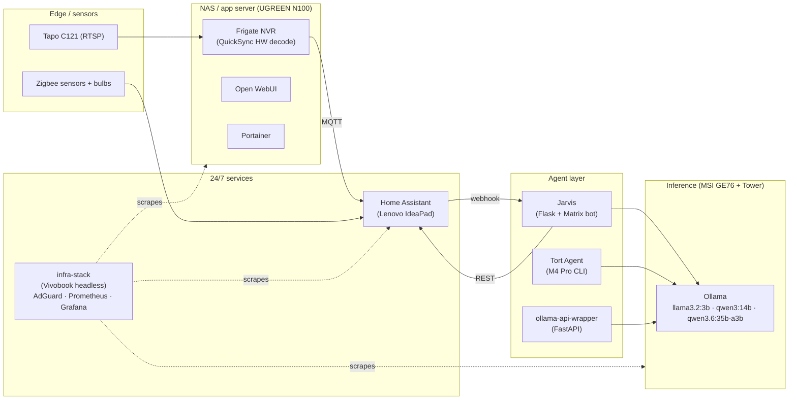

# homelab_setup

> A privacy-first, fully local multi-node homelab — designed as both a working production environment and a portfolio of deployed projects. No cloud LLMs, no SaaS dependencies, no telemetry leaving the network.

---

## Architecture

---

## Projects (each is its own deployed system)

| Project | Path | What it is |
|---|---|---|
| **Jarvis** | [`projects/jarvis/`](./projects/jarvis) · [`Cap-Dylan/Jarvis`](https://github.com/Cap-Dylan/Jarvis) | Multi-zone LLM agent. Tool-use loop, model routing (3B + 14B), eval harness, CI'd with smoke tests. |
| **infra-stack** | [`projects/infra-stack/`](./projects/infra-stack) | Docker-Composed observability stack: AdGuard Home (DNS sinkhole + threat filtering), Prometheus (15s scrape, 30-day retention, all 4 nodes), Grafana dashboards. |
| **frigate-nvr** | [`projects/frigate-nvr/`](./projects/frigate-nvr) | Local CV pipeline. Tapo C121 RTSP → Frigate w/ Intel QuickSync hardware decode → MQTT → Home Assistant. Detection events live. |
| **ollama-api-wrapper** | [`projects/ollama-api-wrapper/`](./projects/ollama-api-wrapper) | FastAPI service exposing local LLM inference: `/health`, `/ask`, `/summarize`. Reused by other tools across the lab. |
| **Tort Agent** | [`Cap-Dylan/tort-agent`](https://github.com/Cap-Dylan/tort-agent) | Local LLM workflow assistant. Native tool calling on Qwen3.6 35B; integrates with Canvas LMS, Apple Notes, Obsidian. |

CI runs on every push to `main` — see [`.github/workflows/ci.yml`](./.github/workflows/ci.yml). Smoke tests assert on business logic (brightness boundaries, Flask routes), not just syntax.

---

## Hardware

| Device | Role | Specs |
|---|---|---|
| Custom Tower | Heavy ML training / large-model inference | i7-14700 + RTX 4090 24GB · 128GB DDR5 |
| MSI GE76 Raider | 24/7 local inference (headless) | i7-9750H + RTX 2060 8GB · 32GB · Ubuntu Server 24.04 |
| UGREEN NASync DXP2800 | NAS / app server | Intel N100 · 8GB DDR5 · UGOS Pro |
| Lenovo IdeaPad 1 | Home Assistant (bare-metal) | Celeron N4500 · 36GB |
| ASUS Vivobook 16 | infra-stack host (headless) | i5-1135G7 · 8GB · Ubuntu 24.04 |
| MacBook Pro 14" | Daily driver / Tort Agent host | M4 Pro · 24GB unified |
| Surface Go 3 | Planned HA kiosk | Pentium Gold 6500Y · 4GB |

Networking: TP-Link BE3600 (Wi-Fi 7, 2.5G) · Tailscale mesh across all nodes (no public ports exposed) · segmented IoT SSID · DNS routes through AdGuard.

Full hardware + networking writeup: [`docs/infrastructure.md`](./docs/infrastructure.md).

---

## Design principles

- **Privacy first** — all inference is local. Cloud LLMs reserved only for hard reasoning where they're worth it.
- **Right-sized hardware** — N100 / IdeaPad for 24/7 services, RTX 4090 only when training or running large models.
- **Repurposed where possible** — old laptops as headless servers. Sustainability + cost.
- **Observable** — everything that matters has metrics scraped and a Grafana panel. Failures alert to Matrix.
- **Reproducible** — every project under `projects/` is `docker compose up -d` plus a `.env`. No snowflake servers.

---

## License

MIT — see [LICENSE](./LICENSE).
