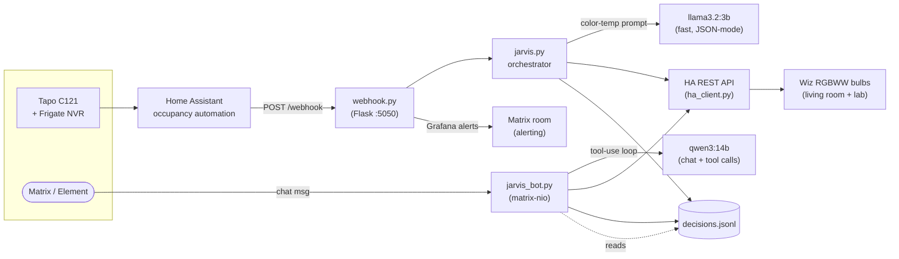

# Jarvis

> Fully local agentic smart home system. Two input paths — automated motion-triggered events and a Matrix chat interface — share one decision log, one HA backend, and a model-routing brain. No cloud LLMs, no SaaS dependencies, no telemetry leaving the network.

---

## Why two paths, one brain

Most "smart home AI" projects are either rule-based automations *or* a chat bot. Jarvis is both, and the interesting part is making them share state cleanly.

- **Automated path** — Frigate detects occupancy → HA fires a REST command → Flask webhook receives the event → small fast model picks a color temperature → HA executes the action → decision is logged.
- **Conversational path** — User sends a message in Element → Matrix bot receives it → larger model decides whether to call a tool, what state to fetch, and what to say back → same HA backend, same decision log.

When you ask Jarvis "why did you turn on the light?" in chat, it reads the same `decisions.jsonl` that the automated path writes to. The two systems converge in the log and in the hardware they control.

---

## Architecture



Two zones are wired today (`living_room` and `lab`); each has independent cooldown and turn-off-delay timers in `jarvis.py`.

---

## Why model routing — and the eval that backs it

Both paths could in principle run on the same model. They don't, because the workloads are different shapes:

- **Color-temperature decisions** are tight, repetitive, and structurally rigid — output is `{"color_temp_kelvin": int, "reason": str}` and the value space is small. A 3B model is plenty if it'll respect the schema.
- **Chat + tool calls** need conversational coherence and the discipline to emit a clean `tool_call` JSON across multiple turns. A 14B model holds up; a 3B starts hallucinating tool names and arguments.

I didn't want to guess. The repo contains two evaluation harnesses that produced the routing decision:

- **`eval_models.py`** — A/B harness comparing two models head-to-head. Validates JSON shape, key presence, value ranges, and measures inference latency across 8 color-temperature scenarios and 8 bot conversation scenarios. Output: [`eval_report.json`](./eval_report.json).
- **`eval_colortemp.py`** — focused harness on the color-temp prompt across multiple models, with multiple runs per scenario for variance. Output: [`eval_color_temp.json`](./eval_color_temp.json).

The eval results are committed alongside the code. The 3B model produced valid JSON with in-range Kelvin values consistently across runs at sub-second latency on the warm path; the 14B model gave coherent multi-turn tool-call sequences in chat without losing the system prompt's persona. That split — small fast model on the deterministic task, larger model on the open-ended one — is what's deployed.

This is also why `format=json` is enforced in the Ollama call inside `ollama_client.py`. JSON mode constrains the decoder so the model literally cannot emit tokens that would break JSON structure. Combined with the schema validation in `eval_models.py`, JSON parse rate is ~100% for the color-temp path.

---

## Tools the chat agent can call

Defined in [`tools.py`](./tools.py), exposed through a `TOOL_DEFINITIONS` schema the LLM reads as part of the system prompt:

| Tool | What it does |
|---|---|
| `get_light_state` | Read on/off, brightness%, and color temp for a named light. Used before changes when the model needs to know the current state. |
| `set_light` | Turn a named light on or off, optionally with brightness. Logged to `decisions.jsonl` with the user's original message. |
| `get_weather` | Pull weather entity state from HA — temp, humidity, cloud cover. Used by the model to inform color temp suggestions. |
| `get_time` | Current time + period (morning/daytime/evening/night) + suggested brightness. Lets the model self-serve scheduling logic. |
| `get_decision_log` | Read recent decisions when the user asks "why did you do X?". The model reasons over its own log instead of inventing. |

The agentic loop in `jarvis_bot.py` caps tool iterations at `MAX_TOOL_LOOPS = 5` so a model that gets stuck calling the same tool can't run away.

---

## Reliability work that's easy to miss

A handful of things that took longer to get right than they look:

- **Per-zone cooldown and turn-off timers** — `jarvis.py` keeps separate `last_turn_on_time` and `pending_off_timer` dicts keyed by zone. A motion event in the lab can't cancel the living-room turn-off, and vice versa. Without this, the two zones' timers stomped on each other.
- **JSON parse fallback in `jarvis_bot.py`** — when the chat model splits its response into multiple JSON objects (rare but real), there's a recovery path that joins them rather than crashing. Tested explicitly in `eval_models.py`'s `required_split_recovery` issue tag.
- **Markdown-fence stripping** — small models occasionally wrap JSON in ```` ```json ```` fences despite explicit instructions not to. Both the bot and the eval harness strip those before parsing.
- **Connection / timeout handling** — every Ollama and HA call has a timeout and a graceful failure path that returns a useful message to the user instead of dying silently.
- **No-LLM shortcuts** — `!status` queries HA directly without inference. Cheaper, faster, and removes a class of failure modes from the most common operation.

---

## Setup

### Local (single-host dev)

```bash
git clone https://github.com/Cap-Dylan/jarvis.git
cd jarvis

python3 -m venv venv && source venv/bin/activate
pip install -r requirements.txt

cp .env.example .env
# Fill in HA_URL, HA_TOKEN, OLLAMA_URL, MATRIX_* in .env

# Make sure Ollama and Home Assistant are reachable, then run either
# (or both) services:
python webhook.py        # automated path on :5050
python jarvis_bot.py     # chat path
```

### Docker (recommended for the homelab)

```bash
cp .env.example .env
# Fill in real values

docker compose up -d --build
```

Both `jarvis-webhook` and `jarvis-bot` come up with `restart: unless-stopped`. The decision log lives in a bind-mounted `./data/` directory so it persists across rebuilds.

### Systemd (bare-metal alternative)

`jarvis.service` is provided as a starting point — edit the `User`, `WorkingDirectory`, and `ExecStart` paths to match your deployment, then:

```bash
sudo cp jarvis.service /etc/systemd/system/
sudo systemctl daemon-reload
sudo systemctl enable --now jarvis
```

### HA automations required

Two automations in Home Assistant POST to the webhook on motion events:

```yaml
# Person detected
service: rest_command.jarvis_event
data:
  event: person_detected

# Occupancy cleared
service: rest_command.jarvis_event
data:
  event: occupancy_cleared
```

For a second zone, send `{"event": "person_detected"}` to `/webhook/lab` instead of `/webhook`.

---

## Stack

| Layer | Tech |
|---|---|
| Brain (chat) | qwen3:14b via Ollama |
| Brain (color temp) | llama3.2:3b via Ollama |
| Orchestrator | Python 3.11 (Flask + requests) |
| Chat | Continuwuity (Matrix) + Element |
| Eyes | Tapo C121 → Frigate NVR → Home Assistant |
| Hands | Home Assistant REST API |
| Container | Docker + docker-compose |
| Mesh | Tailscale |
| Alerts | Grafana → webhook → Matrix |

---

## Roadmap

- **Eval harness expansion** — add more conversation scenarios for tool-call accuracy at higher temperatures, and write a CI job that fails on regression.
- **Planner / Executor / Validator architecture** — the current single-loop tool-use design works well for short tasks; multi-step plans (e.g. "set up lab for a long study session") would benefit from explicit planning.
- **Voice surface** — local STT/TTS on the M4 Pro fronting the same agent.

---

## License

MIT — see [LICENSE](LICENSE).
